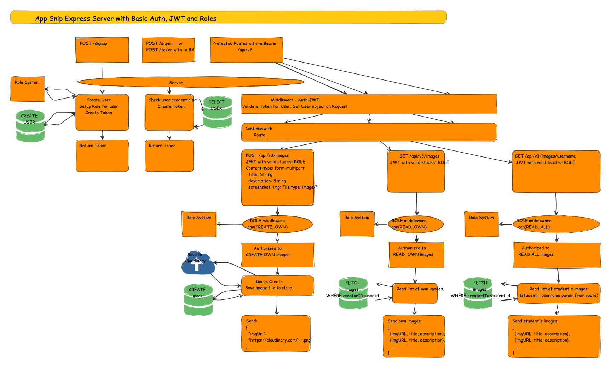

# App Snip Server

## Intallation and Setup

You will need to set environment variables for

    SECRET={Your App secret}
    DATABASE_URL={For your databse}
    CLOUDINARY_URL={From your cloudinary account}

## Development

- Clone the repo with `git clone https://github.com/App-Snip/app-snip.git`
- `cd ./app-snip` Then install the dependencies with `npm install`
- Create a `.env` file as described above.
- Start the server with `npm start`
- Access the app with the cli. You can start it in development with `npm run connect-dev` Be sure to create a directory called `test-data` and populate it with images to upload before you begin.
- You can also hit the routes with ThunderClient and a bearer auth token.
- To do a create, you need to use a multipart-form and put the file in screenshot_img. Creating an image can be done with httpie like so: `http -f -A bearer -a ${VALID_JWT_TOKEN} POST :3000/api/v3/images title="My Screenshot" screenshot_img@${FILENAME.JPG}`

## Diagram of routes

## Usage

You can access the server with a cli tool. See instructions on how to use it here: [https://github.com/App-Snip/app-snip-cli](https://github.com/App-Snip/app-snip-cli)
